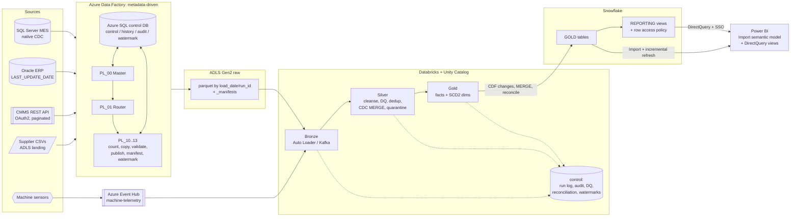

# NorthForge Manufacturing Modernization: Azure Data Factory + Databricks + Snowflake + Power BI

An enterprise-style **data engineering platform for a manufacturer**. It ingests
MES (SQL Server, with **native CDC**), ERP (Oracle), maintenance (REST API),
supplier files (ADLS) and **machine IoT telemetry (Event Hub, streaming)**.
Everything flows through a governed **Medallion architecture on Databricks**, is
**reconciled at every hop**, is modelled as a **star schema with SCD Type 2**,
is published to **Snowflake**, and is consumed by **Power BI**.

> **Synthetic project.** NorthForge Industries is fictional. All data comes from
> `src/datagen/` with a fixed seed. Host names, IDs and e-mail addresses are placeholders.

## Architecture at a glance



The rule that governs every hop is simple: **a watermark, checkpoint or publish
version only moves forward after the data is written and reconciled.** If
anything fails, nothing advances, the same window is replayed, and every write is an
idempotent MERGE, so the replay is harmless.

## What each part demonstrates

| Area | Where | Highlights |
|---|---|---|
| **ADF, metadata-driven** | `adf/`, `sql/control_db/` | One master, one router and four source-type children drive **every** table from `ctl.ingestion_control`. The extraction window is frozen per run, which makes retries replayable. Counts are validated by a stored procedure gate. Write-audit-publish (staging → raw). Rerun-from-failure. Retries for network failures. Skip-and-log for bad file rows. A Logic App handles alerts. |
| **CDC** | `sql/source_systems/`, `docs/CDC_EXPLAINED.md`, `sample_data/cdc_explained/` | SQL Server CDC (LSN windows, `__$operation` 1/2/3/4, LSN-gap detection) versus Oracle watermark versus API versus files. Real-looking sample CDC rows you can open. |
| **Bronze** | `src/bronze/` | Auto Loader (`availableNow`, schema evolution, rescued data) plus **ADF → Bronze manifest reconciliation**. |
| **Silver** | `src/silver/`, `src/framework/dq.py` | Registry-driven cleansing and standardization, null defaults, a DQ rule engine (ERROR goes to quarantine, WARN is flagged), dedup, and an **out-of-order-safe CDC MERGE** with soft deletes. Each micro-batch is reconciled. |
| **Streaming** | `src/streaming/` | Event Hub (Kafka endpoint) → Bronze raw → Silver with watermarking, `dropDuplicatesWithinWatermark`, and 1-minute anomaly aggregates. |
| **Gold** | `src/gold/`, `docs/DATA_MODEL.md` | Star schema with an explicit grain, **generic SCD2 MERGE**, deterministic surrogate keys, point-in-time dimension lookups, CDF-driven incremental facts, and OEE. |
| **Reconciliation** | `src/framework/reconciliation.py` | Checks ADF→Bronze, Bronze→Silver, Silver target verification, Silver→Gold (count + SUM) and Gold→Snowflake. |
| **Snowflake** | `src/publish/`, `sql/snowflake/` | CDF → STAGE → MERGE → reconcile. Key-pair auth, RBAC, warehouses per workload, a resource monitor, reporting views and a row access policy. |
| **Power BI** | `powerbi/` | PBIP/TMDL semantic model: Import with incremental refresh, Dual and DirectQuery storage modes, DAX (OEE, FPY, MTTR/MTBF, time intelligence), RLS, and an event-driven refresh. |
| **Ops & governance** | `docs/` | Security, lineage (Unity Catalog + Purview + run-id columns), a runbook, troubleshooting and the interview guide. |

## Repository map

```text
manufacturing_databricks/
├── README.md · RUNBOOK.md
├── adf/                     ADF Git-mode artifacts: factory, IR, linked services, datasets, pipelines, triggers
├── sql/
│   ├── control_db/          Azure SQL: control table, run history, audit, watermark history, stored procedures, seed
│   ├── source_systems/      SQL Server CDC enablement, Oracle ERP tables (what the source DBAs run)
│   ├── databricks/          Unity Catalog: catalog/schemas/grants, control tables, gold star schema + seeds
│   └── snowflake/           warehouses/roles/users, gold tables, reporting views, row access policy
├── configs/                 dev/test/prod + source_registry.yml (Databricks half of the metadata)
├── src/
│   ├── common/              config, notebook helpers, logging, performance (AQE, salting, sizing)
│   ├── framework/           run context, control/watermarks, audit, alerting, DQ engine, reconciliation
│   ├── datagen/             synthetic sources (2 business days: initial + incremental/CDC)
│   ├── bronze/              Auto Loader + manifest reconciliation
│   ├── streaming/           Event Hub → bronze → silver
│   ├── silver/              standardization, CDC merge, per-batch processor
│   ├── gold/                SCD2 engine, dimensions, facts
│   └── publish/             Snowflake publisher, Power BI refresh trigger
├── notebooks/               Databricks task notebooks (00_setup … 06_publish), 07_demos, 08_maintenance
├── resources/jobs/          Asset Bundle jobs: batch pipeline, continuous IoT streaming, setup, weekly table maintenance
├── powerbi/                 PBIP project: TMDL semantic model, report spec, DAX reconciliation
├── tools/                   generators for the ADF JSON and the Power BI TMDL
├── sample_data/             small generated samples (raw layout, manifests, CDC explainer, API pages, IoT)
├── tests/                   pure-Python + Spark tests
└── docs/                    architecture and framework docs, interview guide
```

## Documentation

| Doc | Read it for |
|---|---|
| [RUNBOOK.md](RUNBOOK.md) | Deploying and operating the platform: first-time setup, daily run, reruns, backfills, watermark resets |
| [docs/ARCHITECTURE.md](docs/ARCHITECTURE.md) | End-to-end design, layer by layer, with the sequence of one entity's journey |
| [docs/ADF_FRAMEWORK.md](docs/ADF_FRAMEWORK.md) | The metadata-driven ADF design: idempotency, retries, fault tolerance, restartability, alerting |
| [docs/CDC_EXPLAINED.md](docs/CDC_EXPLAINED.md) | **What CDC actually looks like**, and how each source is loaded incrementally |
| [docs/DEVELOPER_STANDARDS.md](docs/DEVELOPER_STANDARDS.md) | The standards every developer follows, including onboarding a new source in 2 files |
| [docs/DATA_QUALITY_AND_RECONCILIATION.md](docs/DATA_QUALITY_AND_RECONCILIATION.md) | DQ rules, quarantine, and the 5 reconciliation checkpoints |
| [docs/DATA_MODEL.md](docs/DATA_MODEL.md) | Star schema, grain, SCD2, surrogate keys, OEE definitions |
| [docs/PERFORMANCE_AND_SCALE.md](docs/PERFORMANCE_AND_SCALE.md) | **Partitioning, repartition/coalesce, skew and salting, broadcast, OPTIMIZE / VACUUM / Z-ORDER, liquid clustering: file-by-file index** |
| [docs/STREAMING.md](docs/STREAMING.md) | The IoT pipeline: Event Hub, watermarks, dedup, late data |
| [docs/POWERBI_AND_SNOWFLAKE.md](docs/POWERBI_AND_SNOWFLAKE.md) | Publishing to Snowflake, **views vs semantic model**, Import vs DirectQuery, RLS |
| [docs/SECURITY.md](docs/SECURITY.md) | Identities, Key Vault secrets, network, Unity Catalog, Snowflake and Power BI security |
| [docs/LINEAGE.md](docs/LINEAGE.md) | Unity Catalog lineage, Purview for ADF, and run-level lineage columns |
| [docs/project_delivery/](docs/project_delivery/README.md) | **Delivery documentation pack**: charter, BRD/KPI glossary, source interface agreements, profiling, HLD, LLD, STTM (CSV), NFR, security, DQ spec, test/UAT, release, ops handover, RACI/RAID/ADR, Confluence/Jira governance |
| [docs/TROUBLESHOOTING.md](docs/TROUBLESHOOTING.md) | Production-support scenarios and their fixes |
| [docs/INTERVIEW_GUIDE.md](docs/INTERVIEW_GUIDE.md) | How to present the project, with a deep-dive Q&A |

## Quick start (local: no cloud, no Java needed)

```bash
python3 -m venv .venv && source .venv/bin/activate
pip install -r requirements-dev.txt
python -m src.datagen.generate_synthetic_data --out-dir sample_data   # regenerate the samples
pytest -q                                                              # Spark tests auto-skip without a JDK
```

To deploy to Azure, Databricks, Snowflake and Power BI, follow [RUNBOOK.md](RUNBOOK.md).
