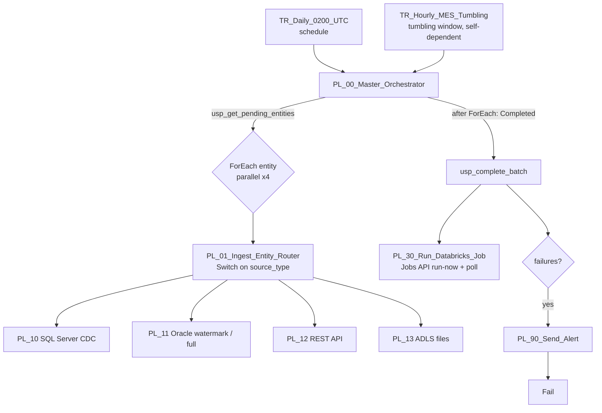
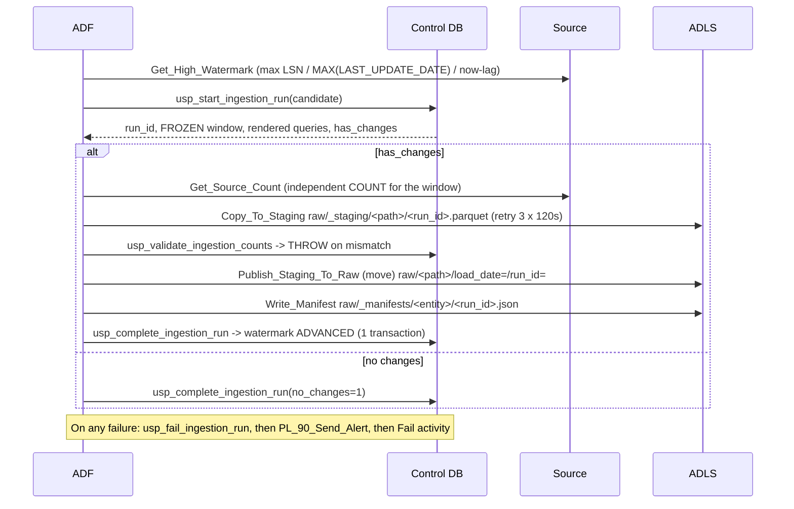

# Azure Data Factory: the metadata-driven ingestion framework

## 1. Design goals

1. **One pipeline set for every table.** New tables are rows in a control table, not new pipelines.
2. **Idempotent.** Any run can be retried or re-triggered without duplicates or gaps.
3. **Resilient.** Transient network failures are retried automatically, and permanent failures are isolated to one entity.
4. **Restartable.** Re-running the master after a partial failure only re-processes what failed.
5. **Reconciled.** No watermark advances unless source count = rows read = rows copied (+ tolerated rejects).
6. **Observable.** Every run, attempt, count, watermark move and error is in the control DB, and failures page on-call.

## 2. Components

| Artifact | Purpose |
|---|---|
| `ctl.ingestion_control` | One row per entity: source type, the query templates, watermark type and value, target folder, tolerances, owner |
| `ctl.ingestion_run_history` | One row per entity per window: frozen window, rendered query, counts, status, attempts, error |
| `ctl.batch_run` | One row per master execution, with success/failure totals |
| `ctl.watermark_history` | Every watermark movement (automatic or manual reset, with reason) |
| `ctl.audit_log` | Event trail: RUN_STARTED, RUN_RETRY, COUNTS_VALIDATED, RECON_FAILED, WATERMARK_ADVANCED, FILES_DETECTED… |
| `IR-SelfHosted-OnPrem` | 2-node HA self-hosted IR in the plant data centre. Outbound 443 only. |
| `LS_*` | Linked services. Managed identity for Azure resources; Key Vault for SQL Server, Oracle and the API secret. |
| `DS_*` | 8 parameterised datasets reused by every pipeline |

## 3. Pipelines



### The child-pipeline contract (identical for all 4 source types)



## 4. How each non-functional requirement is met

### Idempotency

- **Frozen window.** `usp_start_ingestion_run` stores `window_start`/`window_end` on the first attempt. A retry, even days later, **reuses the same run_id and window**, extracts the same rows, and writes to the **same path and file name** (`<run_id>.parquet`), so the output is overwritten, not duplicated.
- **Write-audit-publish.** Copy writes to `_staging/`. Only validated files are moved to the path that Auto Loader watches. A half-written copy is never seen downstream.
- **Watermark last.** `usp_complete_ingestion_run` is the only code that moves a watermark, and it refuses unless the run is `VALIDATED`. It is also idempotent (a second call is a no-op).
- **Downstream.** Silver MERGE only accepts newer `_sequence` values. If a file is somehow ingested twice, silver still converges.

### Network failures and transient errors

- Copy, Lookup and Web activities have `retry: 3`, `retryIntervalInSeconds: 120`, and timeouts sized per activity.
- The self-hosted IR runs on 2 nodes, so losing one node does not stop extraction.
- REST: `httpRequestTimeout` 2 minutes, `requestInterval` 200 ms (throttling-friendly), and bounded pagination (`MaxRequestNumber`).
- Count validation is **not retried** (`retry: 0`), because a mismatch is a data problem, not a transient one.

### Fault tolerance

- **Entity isolation.** ForEach runs entities in parallel and one failure does not cancel the others. `usp_complete_batch` records `PARTIAL_FAILURE`.
- **Partial pipeline progress.** If a child fails after the copy but before the watermark moves (for example, the manifest write failed), the run stays `VALIDATED`/`FAILED`. The next run resumes with the same frozen window and overwrites the same files.
- **Bad rows in files.** `enableSkipIncompatibleRow` with logging to `raw/_rejected/<entity>/<run_id>/`. The validation SP enforces `max_reject_pct` (2% for supplier files); above that, the run fails.
- **Tumbling window trigger** (hourly MES): each hour runs exactly once, is retried twice automatically, and the **self-dependency** means hour N+1 waits for hour N to succeed, which keeps CDC ordered.

### Restartability ("rerun from failure")

`usp_get_pending_entities` skips entities that already reached `SUCCESS`/`NO_CHANGES` for the run date.

To recover after fixing the cause, **run `PL_00_Master_Orchestrator` again**. Only the failed entities are processed. `force_rerun = true` overrides this, for example to re-pull a reference table.

### Reconciliation (ADF side)

`usp_validate_ingestion_counts`:

```
source_count (independent COUNT on the source for the frozen window)
  == rows_read (Copy output)
  == rows_copied + rows_skipped (Copy output)
and rows_skipped / rows_read <= max_reject_pct
```

The manifest then carries `rows_copied` to Databricks, which checks that the same number of rows reached bronze.

### Alerting

- **One path for everything:** `PL_90_Send_Alert` posts to a Logic App, which e-mails the on-call distribution list and posts to a Teams channel. The webhook URL (it contains a SAS token) comes from Key Vault.
- **The same Logic App is used by Databricks** (`src/framework/alerting.py`), so the alert format is consistent across platforms.
- **Azure Monitor alert rules (configured in the portal / IaC):**
  - ADF `PipelineFailedRuns > 0`;
  - self-hosted IR node offline;
  - IR CPU above 80% for 15 minutes;
  - an ADF diagnostic setting sends logs to Log Analytics for KQL dashboards.

### Security

- No passwords in JSON. SQL Server and Oracle passwords are `AzureKeyVaultSecret` references.
- ADF's **managed identity** authenticates to ADLS, the control DB, Key Vault and the Databricks Jobs API.
- Web activities that handle secrets or tokens use `secureInput`/`secureOutput`, so the values never appear in the run history.

### Lineage

With the factory connected to **Microsoft Purview**, every Copy activity reports source → sink lineage automatically. Runs are also traceable through `adf_pipeline_run_id` in the control DB and the manifests (see [LINEAGE.md](LINEAGE.md)).

## 5. Import into ADF

The `adf/` folder uses exactly the layout ADF Git integration expects
(`factory/`, `integrationRuntime/`, `linkedService/`, `dataset/`, `pipeline/`, `trigger/`).

1. Push this repo to Azure DevOps or GitHub.
2. ADF Studio → **Manage → Git configuration** → select the repo, collaboration branch `main`, **root folder `/adf`**.
3. Everything appears in the Author hub. Replace the placeholder hosts, then **Publish**.
4. Run `sql/control_db/*.sql` on the control DB, and grant the ADF managed identity access:

```sql
CREATE USER [adf-nf-mfg-dev] FROM EXTERNAL PROVIDER;
ALTER ROLE db_datareader ADD MEMBER [adf-nf-mfg-dev];
ALTER ROLE db_datawriter ADD MEMBER [adf-nf-mfg-dev];
GRANT EXECUTE ON SCHEMA::ctl TO [adf-nf-mfg-dev];
```

**CI/CD.** Build the ARM template with the `@microsoft/azure-data-factory-utilities` npm package in the pipeline. Deploy it to test and prod with environment-specific ARM parameters: Key Vault URL, storage URL, SQL server, and global parameters. Stop triggers before deploying and start them after.

The JSON is also reproducible from `tools/generate_adf_artifacts.py`.

## 6. ADF-native transformations: Power Query and the CDC data flow

Two extra pipelines show the transformation engines **inside** ADF. Both run on ADF-managed Spark
(Azure IR, General compute, 8 cores), which is **billed only while they run**. Opening, editing or **Validating**
them is free. *Data flow debug* starts a billed cluster, so leave it off unless you mean to test.

### PL_14_PowerQuery_Supplier_Cleansing (Power Query)
```
landing/supplier_deliveries/incoming/*.csv
   └─ Copy_Merge_Supplier_Files (MergeFiles) ─► landing/.../powerquery_input/supplier_deliveries_current.csv
         └─ Run_PowerQuery_Cleansing (PQ_Supplier_Delivery_Cleansing) ─► raw/supplier_files/delivery_powerquery/ (parquet)
```
| M step | What it does |
|---|---|
| `Trimmed` | `Text.Trim` on every text key |
| `Uppercased` / `ProperNames` | Codes to upper case, supplier names to proper case |
| `Typed` | `delivery_date` to date, quantities to Int64 |
| `HasKey` / `ValidQty` | Drop rows without a key, or with impossible quantities |
| `Deduped` | One row per `delivery_id` (suppliers re-send lines) |
| `WithAccepted` | `accepted_qty = delivered - rejected` |

**When to use Power Query:**
- Simple, business-owned cleansing that analysts want to read and change themselves, in the same editor they know from Excel and Power BI.
- ADF translates the M steps to Spark when the pipeline runs.

**Limits we designed around:**
- Cloud sources only: no self-hosted IR, so it can't read on-prem SQL Server or Oracle.
- No dataset parameters, so fixed datasets plus a merge step.
- One output; it can't split good and bad rows. Invalid rows are *dropped*, not quarantined.

That last limit is why the production path stays **PL_13 → Databricks silver**: its DQ engine quarantines and reconciles every row.

### PL_15_CDC_Apply_DataFlow (mapping data flow: CDC apply)
```
raw/sqlserver_mes/production_log/load_date=…/run_id=…/*.parquet   (CDC rows landed by PL_10: ops 1/2/4)
   └─ DF_MES_ProductionLog_CDC_Apply
        CdcChanges ─► RankVersions (window: per production_log_id, lsn desc, seqval desc)
                   ─► LatestPerKey (rank = 1)
                   ─► MarkRowAction (Alter Row: deleteIf op = 1, upsertIf op ≠ 1)
                   ─► FinalColumns ─► DeltaCurated (Delta MERGE on production_log_id, curated/adf_cdc/mes_production_log)
```

**Why it exists:**
- It shows CDC applied **with ADF only**: no Databricks needed for a simple replica.
- In interviews it answers "how would you apply CDC in ADF?".

**Why the platform still uses Databricks for silver:**
- ADF's Alter Row upsert has **no sequence guard**: replaying an older run would overwrite newer data. So PL_15 must process runs strictly in order, one run folder per execution.
- Data flows can't reach on-prem SQL Server (extraction stays in PL_10 via the self-hosted IR).
- There's no DQ quarantine or per-batch reconciliation framework.

**ADF's own "Change Data Capture" resource** (top-level, under Author) is the third option. It needs a source that the Azure IR or a managed VNet can reach. On-prem MES via the self-hosted IR isn't one of them, which is why CDC extraction here is the Copy-based `PL_10`.
