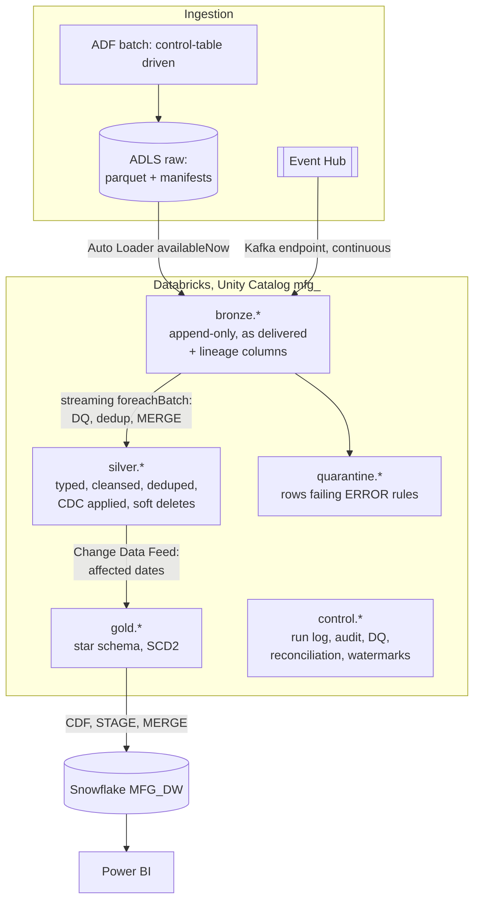
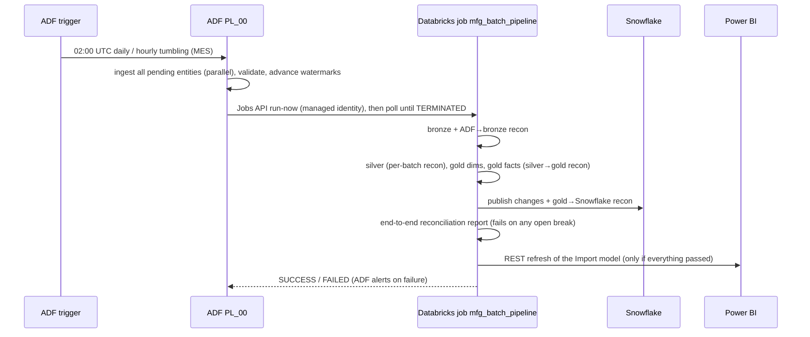

# Architecture

## 1. Business context

NorthForge Industries (a fictional manufacturer) runs 3 plants: Pune (assembly), Monterrey (stamping) and Brno (machining).
Before this programme, plant KPIs were produced from Excel extracts of each system. The numbers
disagreed between plants and finance, and they were always a day or more old.

**Goals**
- A single, trusted source for production, quality, OEE, maintenance and supplier KPIs.
- Near-real-time machine health from IoT sensors.
- Enterprise controls: incremental and idempotent loads, reconciliation, audit, lineage and security.
- Serving on the company's Snowflake + Power BI estate.

## 2. Sources

| Source | System | Entities | Pattern | Frequency |
|---|---|---|---|---|
| SQL Server 2019 (on-prem) | MES | machine, production_log, quality_inspection | **Native CDC** (LSN windows) | hourly (transactions), daily (machine) |
| Oracle 19c (on-prem) | ERP | plant, product, production_order | Watermark on `LAST_UPDATE_DATE`; full load for plant | daily |
| REST API (SaaS) | CMMS maintenance | work_order | `updated_since` window, OAuth2, pagination | daily |
| ADLS Gen2 `landing` | Supplier SFTP drops | supplier_delivery CSVs | File `LastModified` window, then archive | daily |
| Azure Event Hub | Machine gateways (OPC-UA → MQTT → Event Hub) | sensor readings | Structured Streaming | continuous |

## 3. Layers

| Layer | Contains | Rules |
|---|---|---|
| **Raw (ADLS)** | Parquet exactly as extracted, one folder per run; manifests | Written only by ADF after validation (write-audit-publish) |
| **Bronze** | Source columns as delivered, as **strings**, plus `_ingestion_run_id`, `_source_file`, `_load_date`, `_ingest_ts`, `_rescued_data` | Append-only. No business logic. Always replayable. |
| **Silver** | Conformed names and types, standardized values, one row per business key (latest), `_is_deleted`, `_sequence`, `_dq_warnings`, `_pipeline_run_id` | Contract defined in `configs/source_registry.yml`. CDF enabled. |
| **Quarantine** | Rejected rows with `_dq_errors` | Never silently dropped. Alert raised. Fixed at source and flows again through CDC. |
| **Gold** | Facts and dimensions (see [DATA_MODEL.md](DATA_MODEL.md)) | Surrogate keys, SCD2, explicit grain, CDF enabled for publishing |
| **Control** | `pipeline_run_log`, `audit_log`, `dq_results`, `reconciliation_results`, `watermarks` | Append-only operational metadata |

## 4. Orchestration

- **Why ADF triggers Databricks** (and not a separate schedule): the dependency is explicit. Databricks never starts before landing has finished, and one monitoring view (ADF) shows the end-to-end run.
- **Fallback:** the Databricks job also has a **file-arrival trigger** on `_manifests/`, paused by default. It can be enabled if ADF orchestration is unavailable.
- **The IoT stream** runs independently as a **continuous job**. Gold reads its 1-minute aggregates.

## 5. Key design decisions

| Decision | Alternatives | Why |
|---|---|---|
| ADF for extraction, Databricks for transformation | Databricks JDBC directly to on-prem | The self-hosted IR is the approved on-prem gateway, and ADF gives native CDC/Oracle/REST connectors, Purview lineage, and a low-code operations view. Spark is used where it excels: transformations. |
| Parquet in raw, not direct-to-Delta from ADF | ADF Delta sink | It decouples ADF from Delta versions, keeps an immutable extract per run (audit/replay), and Auto Loader gives exactly-once file tracking. |
| Bronze as strings | Typed bronze | Type problems never fail ingestion. Silver casts, and failed casts become NULL, which DQ catches and quarantines. |
| Streaming `availableNow` for batch silver | Batch read + watermark table | The checkpoint is the watermark. A failed batch is not committed and is replayed automatically. |
| Soft deletes in silver | Hard delete | Audit trail. CDF propagates the delete to gold and Snowflake. |
| Deterministic hash surrogate keys | IDENTITY columns | Rebuilds, backfills and new environments regenerate the same keys, so there are no orphaned facts in Snowflake or Power BI. |
| Gold recompute by affected date | Full rebuild / row-level merge of aggregates | Correct for late corrections (CDC updates to past days), bounded cost. |
| Snowflake as serving layer | Databricks SQL Warehouse | It is the enterprise BI standard: existing Power BI gateways, Finance's SQL users, RBAC and row access policies. Gold in Delta stays the source of truth. |
| Event-driven Power BI refresh | Fixed schedule | Users never see unreconciled or half-published data. |

## 6. Environments

| | dev | test | prod |
|---|---|---|---|
| Unity Catalog | `mfg_dev` | `mfg_test` | `mfg_prod` |
| Storage | `stnfmfgdev` | `stnfmfgtest` | `stnfmfgprod` |
| ADF | `adf-nf-mfg-dev` | `-test` | `-prod` (ARM deploy from `adf_publish`) |
| Snowflake DB | `MFG_DW_DEV` | `MFG_DW_TEST` | `MFG_DW` |
| Power BI | Dev workspace | Test workspace | Prod workspace (deployment pipeline) |
| Runs as | developer | service principal | service principal `sp-nf-mfg-databricks-jobs` |
