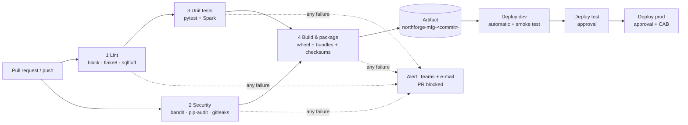

# CI/CD in plain language

## The one-paragraph version
Every time someone proposes a change (a pull request), a robot checks it:

1. Is the code tidy?
2. Is it safe?
3. Do the tests pass?
4. Can it be packaged?

If **any** check fails, the change is **blocked from merging** and the team is told. If everything
passes on `main`, the robot builds **one sealed package** and ships *that exact package* to dev, then
(after a person approves) to test, then (after approval) to prod. Nobody deploys from a laptop.



Files: [`.github/workflows/ci.yml`](../.github/workflows/ci.yml), [`cd.yml`](../.github/workflows/cd.yml), [`deploy-env.yml`](../.github/workflows/deploy-env.yml).

## The stages, like you're explaining it to a new joiner

| Stage | What it does, in plain words | Tool | Fails the pipeline when… |
|---|---|---|---|
| **Lint: Python** | "Spell-check and grammar-check" for code. black checks formatting is identical everywhere; flake8 finds unused imports, undefined names, and lines that are too long. | black, flake8 (`.flake8`, `pyproject.toml`) | Any file is not formatted, or has a flake8 error |
| **Lint: SQL** | The same for SQL files, with the right dialect per folder (Databricks, Snowflake, T-SQL, Oracle). Example of what it caught here: mixing `GROUP BY 1, 2` with named columns in the same file. | sqlfluff (`.sqlfluff` + one per `sql/` folder) | Any rule violation or unparsable SQL |
| **Security: code** | Reads the Python looking for risky patterns. It caught real ones here: calling any URL without checking it is `https`, and SQL built from strings. | bandit | A finding of medium or higher severity **with high confidence**. Lower-confidence findings go into a report for review. |
| **Security: dependencies** | Checks every library version against public vulnerability databases. It caught real ones here: pyspark 3.5.1 and pytest 8.4.2. We upgraded both. | pip-audit | Any known vulnerability not explicitly accepted (accepted ones are listed with a reason in the workflow) |
| **Security: secrets** | Searches every file **and every old commit** for passwords, keys and tokens | gitleaks | Any secret found |
| **Unit tests** | Runs ~50 automated checks on the logic (details below). Spark tests run too, because CI installs Java. | pytest | Any test fails |
| **Build & package** | Turns the code into an installable, versioned package (a wheel), bundles the Databricks jobs, ADF, SQL and Power BI files, and writes checksums and build info | python -m build | Build error |
| **Artifact** | Stores the sealed package, named after the commit, for 90 days | GitHub artifacts | n/a |
| **Deploy** | Downloads **that** package (never rebuilds), checks the checksums, deploys, and smoke-tests | Databricks CLI, ARM, schemachange | Any step fails, which raises an alert and stops the promotion |

## Your questions, answered

### "If linting fails, do we fail the pipeline?"
**Yes.**
- The `lint` job goes red, the `unit-tests` job does not even start (it `needs: lint`), and the PR shows a red ✗.
- Branch protection on `main` ("Require status checks to pass") makes the **Merge button unavailable** until it's fixed.
- SQL lint findings appear as comments **on the exact line** in the PR diff.
- **To avoid wasting a CI run:** developers install the pre-commit hooks (`.pre-commit-config.yaml`). The same checks then run in about 2 seconds at `git commit`, on their laptop.

### "Is an alert sent when the pipeline fails?"
**Yes, in two ways:**
1. GitHub automatically e-mails the person who pushed.
2. The `notify-failure` job posts to the team's Teams channel, with the link to the failed run. It needs the `TEAMS_WEBHOOK_URL` secret; the webhook URL is itself a secret.

Deployment failures post a separate "DEPLOY FAILED: <env>" alert.

> Don't confuse this with **data pipeline** alerts (ADF / Databricks failures at 02:00). Those go through the Logic App to the on-call rota (`docs/ADF_FRAMEWORK.md`). CI/CD alerts go to the **developers**; data alerts go to **operations**.

### "Unit test for 'only active customers go from raw to silver': do we re-check the whole dataset and fail on a count mismatch?"
This mixes up **two different safety nets**. A good answer in an interview separates them clearly:

| | **Unit test** (CI, before deployment) | **Runtime data check / reconciliation** (every pipeline run, in production) |
|---|---|---|
| Question it answers | "Is my **code** correct?" | "Did **today's data** come through correctly?" |
| Input | A **tiny hand-made dataset** where you already know the answer: 6 rows, 3 active, 3 inactive | The **real** incoming data: millions of rows you don't know in advance |
| Check | Output is **exactly** rows 1, 2, 3 | incoming = promoted + rejected + duplicates, so nothing is silently lost |
| When it runs | On every PR, in CI, in seconds | Inside the job, every batch |
| If it fails | The PR is blocked; the bad code never reaches production | That batch is stopped, the checkpoint/watermark doesn't move, and on-call is alerted |
| In this repo | `tests/test_spark_silver.py::test_only_valid_rows_are_promoted_to_silver` | `src/silver/processor.py` (BRONZE_TO_SILVER reconciliation) |

**Why the unit test doesn't use the full production dataset:**
- You can't know the "right answer" for millions of real rows in advance.
- Production data changes every day, so the test would pass or fail at random.
- Real data may contain personal information that doesn't belong in CI.
- It would take hours.

Unit tests use **fixtures**: small, fixed, synthetic inputs designed to hit every rule, including edge cases (scrap exactly equal to produced, a missing machine id).

**Why the runtime check doesn't compare against "expected rows":** in production there *is* no expected answer.
So it checks a **balance** instead: every incoming row must end up somewhere. For the active-customers example:

```
incoming customers (bronze)  =  active promoted to silver  +  inactive filtered out  +  rejected by DQ  +  duplicates
```

If that equation doesn't hold, a row vanished without explanation. The batch fails and is replayed after the fix.

**Interview-ready sentence:**
> "Unit tests prove the *logic* on a tiny fixture with a known answer. For example, 6 customers go in, the 3 active ones must come out, and they run in CI and block the merge. Separately, every production run reconciles the *real* volumes: incoming must equal promoted plus filtered plus rejected. A mismatch stops that batch before the watermark moves and alerts on-call. One protects us from bad code, the other from bad data."

### "What does 'build once, deploy many' mean, and why?"
- CI builds the package **once** and stores it with a checksum. Dev, test and prod all deploy **the same file**.
- If we rebuilt for prod, a library could have changed in between, and prod would run something that was never tested.
- **Rollback** = re-run the CD workflow with an older CI run id (`workflow_dispatch → ci_run_id`).

### "How do approvals work?"
GitHub **Environments** (`dev`, `test`, `prod`):
- **dev** deploys automatically.
- **test** and **prod** wait for a named reviewer to click *Approve*. For prod, the reviewer attaches the CAB change number.
- Each environment has **its own secrets**, so a dev credential physically cannot deploy to prod.

## One-time setup in GitHub (for whoever owns the repo)
| Setting | Value |
|---|---|
| Settings → Branches → `main` → protection | Require PR + 1 review; required checks: `lint`, `security`, `unit-tests`, `build-and-package` |
| Settings → Secrets → Actions | `TEAMS_WEBHOOK_URL` (optional) |
| Settings → Environments | `dev`, `test` (reviewers), `prod` (reviewers). Per environment: `DATABRICKS_HOST`, `DATABRICKS_CLIENT_ID`, `DATABRICKS_CLIENT_SECRET` (OAuth service principal) |
| Settings → Variables | `DEPLOY_ENABLED=true` once environments exist; `DATABRICKS_VALIDATE=true`; `ADF_DEPLOY`, `DB_MIGRATIONS` when those are wired |

Until `DEPLOY_ENABLED` is set, CD does nothing. CI works from day one with no secrets at all.
