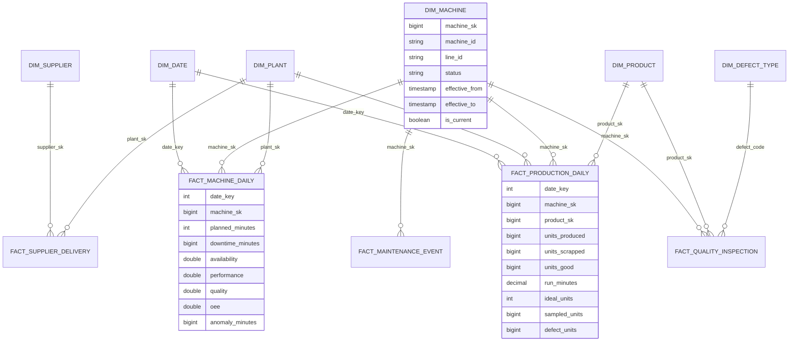

# Gold data model (star schema)

## 1. Diagram

## 2. Grain first

| Fact | Grain | Type | Why this grain |
|---|---|---|---|
| `fact_production_daily` | **1 row per production date × machine × product** | Periodic snapshot (daily) | The business asks "how many of product X did machine Y make per day, with what scrap and defects". Per-run detail stays in silver. |
| `fact_machine_daily` | **1 row per production date × machine** | Periodic snapshot | OEE's **availability** belongs to the machine, not to a product. Splitting downtime across products would invent numbers. |
| `fact_quality_inspection` | 1 row per inspection | Transaction | Drill-through to individual inspections; defect Pareto |
| `fact_maintenance_event` | 1 row per work order | Accumulating snapshot (reported → started → completed) | MTTR / MTBF / response times |
| `fact_supplier_delivery` | 1 row per delivery line | Transaction | Supplier reject rate |

**Production day = the date the shift started.** A C shift from 22:00 to 06:00 belongs to the day it began, which is the standard MES convention and is documented in `dim_shift`.

## 3. Measures and KPIs

| KPI | Formula | Additive? |
|---|---|---|
| Units good | produced − scrapped | yes |
| Scrap rate | Σ scrapped / Σ produced | ratio: re-derive at every level |
| First pass yield | 1 − Σ defect units / Σ sampled units | ratio |
| **Availability** | Σ (planned − downtime) / Σ planned | ratio |
| **Performance** | min(1, Σ units produced / Σ ideal units), where ideal = run minutes × 60 / standard cycle time *as of that day* | ratio |
| **Quality** | Σ good / Σ produced | ratio |
| **OEE** | Availability × Performance × Quality | **never average OEE %** |
| MTTR | Σ breakdown repair minutes / # breakdowns | ratio |
| MTBF | Σ operating hours / # breakdowns | ratio |

Facts store **additive components** (minutes, units). Ratios are computed in DAX, and in the
Snowflake views, from the summed components. That keeps a plant's OEE correct when a machine
planned for 8 hours sits next to one planned for 24 hours.

## 4. Slowly changing dimensions

| Dimension | Type | Tracked attributes | Why |
|---|---|---|---|
| `dim_machine` | **SCD2** | line, status, type, capacity, plant, name, deleted flag | Machines move between lines. Last year's line-level OEE must stay on the old line. |
| `dim_product` | **SCD2** | unit cost, standard cycle time, family, name, SKU | Performance uses the cycle time valid **on the day**. Scrap cost uses the cost valid on the day, so history is not restated. |
| `dim_plant`, `dim_supplier` | SCD1 | names | Corrections only; history is not meaningful |
| `dim_date`, `dim_shift`, `dim_defect_type` | static | | Generated or seeded |

**SCD2 mechanics** (`src/gold/scd2.py`):

- `attr_hash = sha256(tracked attributes)` detects changes.
- One atomic MERGE using the staged-union pattern:
  1. It closes the current version (`is_current = false`, `effective_to = change ts`).
  2. It inserts the new version with `effective_to = 9999-12-31`.
- A brand-new key gets `effective_from = 1900-01-01`, so older facts still resolve.
- Re-running with unchanged data does nothing (the hashes are equal).

**Point-in-time lookup** (`point_in_time_join`): a fact takes the version where
`event_ts >= effective_from AND event_ts < effective_to`. Example from the synthetic data:
`M-P01-03` moved from line P01-L2 to P01-L3 on day 2. Day-1 facts keep pointing at the L2 version.

## 5. Surrogate keys

- **Deterministic:** `xxhash64(business_key, effective_from)`, stored as BIGINT.
  - **Why not IDENTITY?** Identity values depend on insert order. Rebuilding gold (a backfill, a new environment, DR) would give different keys and orphan every fact already in Snowflake and Power BI. Hash keys are reproducible.
  - **Collision risk:** 64-bit hashing over a few thousand dimension rows is negligible. For very large dimensions, use a 128-bit hash or check for collisions in CI.
- **Unknown member `-1`** in every dimension. A fact whose dimension row has not arrived yet (a late-arriving dimension) gets `-1` instead of being dropped. It is re-pointed when the date is recomputed after the dimension arrives.

## 6. Incremental fact loads

1. The gold job reads silver's **Change Data Feed** since `control.watermarks[gold_facts, table]`.
2. It collects the **affected production dates**, including pre-images, so a run that moved day fixes both days.
3. It recomputes those dates and MERGEs on the grain key:
   - update or insert;
   - **delete grain rows that no longer exist** (`WHEN NOT MATCHED BY SOURCE AND production_date IN (affected)`).
4. It reconciles silver against gold for those dates, **then** advances the watermark.
