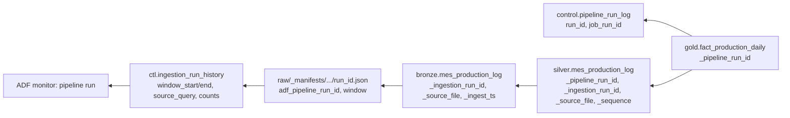

# Lineage

Lineage is captured at three levels:

| Level | Tool | What you get |
|---|---|---|
| **Pipeline / dataset lineage (ADF)** | **Microsoft Purview** connected to the data factory | Every Copy activity reports source table → ADLS folder automatically, visible in the Purview lineage graph |
| **Table + column lineage (Databricks)** | **Unity Catalog** (automatic) | bronze → silver → quarantine → gold, down to columns, for every notebook and job run. It shows the job and notebook that produced each table. |
| **Run-level (row) lineage** | Framework columns + control tables | For any gold row: the exact ADF run, source window and files it came from |

## Run-level lineage chain



**Example: "Why does machine M-P01-01 show 330 units on 24 Sept?"**

```sql
-- 1. which silver versions feed that fact row, and from which ADF run?
SELECT production_log_id, units_produced, _sequence, _ingestion_run_id, _source_file, cdc_operation, cdc_commit_ts
FROM mfg_prod.silver.mes_production_log
WHERE machine_id = 'M-P01-01' AND to_date(start_ts) = '2026-09-24';

-- 2. the full change history of that run, straight from bronze (every CDC version ever received)
SELECT cdc_operation, cdc_start_lsn, units_produced, _ingestion_run_id FROM mfg_prod.bronze.mes_production_log
WHERE production_log_id = '100001' ORDER BY cdc_start_lsn;
```

```sql
-- 3. the ADF run, its frozen window and the exact query executed (control DB)
SELECT run_id, adf_pipeline_run_id, window_start, window_end, source_query, source_count, rows_copied, attempt_no
FROM ctl.ingestion_run_history WHERE run_id = 'mes_production_log_20260925_01';
```

**Delta time travel** completes the audit: `DESCRIBE HISTORY` shows every MERGE with its row
metrics, and `SELECT … VERSION AS OF n` shows what a table looked like before a change.
Retention is set to 30 days (`delta.logRetentionDuration`) in prod.
