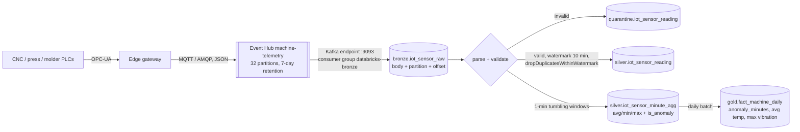

# IoT streaming: Event Hub → Databricks

## Flow



**Message example** (`sample_data/iot/eventhub_messages_2026-09-24.jsonl`):

```json
{"device_id": "GW-M-P02-01-TEMP", "machine_id": "M-P02-01", "sensor_type": "temperature",
 "reading_value": 101.37, "unit": "C", "event_ts": "2026-09-24T14:00:07.000Z", "firmware": "3.4.1"}
```

## Design points

| Concern | How |
|---|---|
| **Connector** | Event Hub's Kafka-compatible endpoint, which uses the Kafka source built into Databricks Runtime. No extra library, and it works the same way against any Kafka. |
| **Credentials** | A listen-only SAS connection string in Key Vault, read through the secret scope. The simulator uses a separate send-only policy. |
| **Exactly-once into bronze** | Offsets are stored in the checkpoint, and the Delta sink commits once per micro-batch. A restart resumes from the committed offsets. |
| **Raw first** | Bronze stores the untouched body. A parser bug is fixed by replaying bronze; the source can't be re-read after the 7-day retention. |
| **Late data** | `withWatermark("event_ts", "10 minutes")`: readings up to 10 minutes late still count in their minute window, and later readings are excluded from aggregates (they stay in bronze). |
| **Duplicates** | Gateways retransmit on network blips, so `dropDuplicatesWithinWatermark(device_id, sensor_type, event_ts)` removes them with bounded state. |
| **State store** | RocksDB state store provider. It keeps large dedup and aggregation state off the JVM heap. |
| **Aggregation output** | `append` mode: each minute window is written once, after the watermark passes it, so downstream only sees final values. |
| **Anomaly flag** | The window's max or min is outside the alarm limits for that sensor type (a CASE expression). |
| **Throughput control** | `maxOffsetsPerTrigger` (50k in dev, 200k in prod) and a 30-second trigger interval. |
| **Operations** | A continuous job restarts automatically after failures, and the `STREAMING_BACKLOG_SECONDS > 600` health rule alerts on consumer lag. |
| **Retention risk** | If the job is down for longer than 7 days, offsets expire. `failOnDataLoss=false` keeps the job running, the gap is visible as missing minutes, and it is alerted on. |

## Demo

The synthetic stream has an **anomaly episode** on `M-P02-01`: temperature and vibration above
alarm limits from 13:00 to 15:00. That is followed by a BREAKDOWN work order on the same machine in the CMMS data.
It shows the value of joining IoT with maintenance in `fact_machine_daily`.
