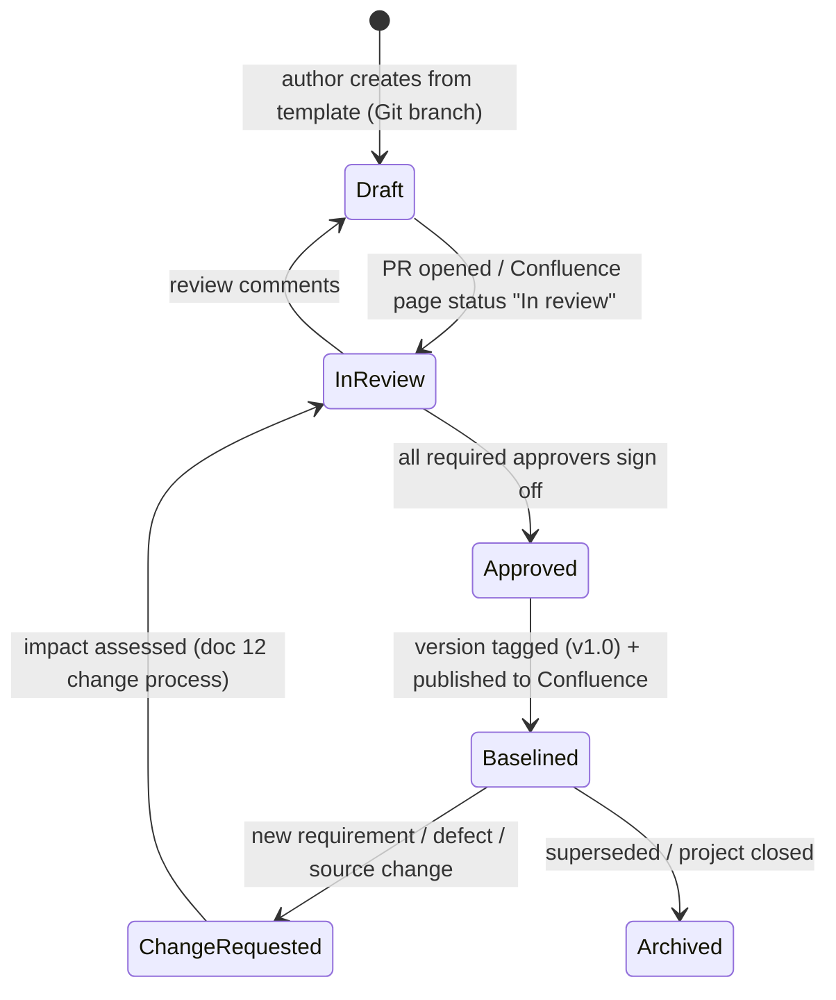

# 00 · Document governance: authoring, validation, publishing to Confluence and Jira, restrictions

## 1. Lifecycle of every document



| State | Where | Who can edit | Rule |
|---|---|---|---|
| Draft | Git feature branch, or Confluence page with status *Draft* | Author(s) | Anything can change |
| In review | PR / Confluence *In review* | Author; reviewers comment | Reviewers are named in the page header |
| Approved | Merged to `main` | Nobody directly | Approval is recorded (PR approvals or a Confluence approval workflow) |
| Baselined | Confluence page `vX.Y`, **edit-restricted** | Document owner only | Changes only through a change request |
| Archived | Confluence *Archive* section | Nobody | Kept for audit (retention per policy, e.g. 7 years) |

**Versioning:**
- `0.x` means draft.
- `1.0` is the first baseline.
- A minor increment (`1.1`) is a clarification with no scope impact.
- A major increment (`2.0`) changes scope, design or contract. It needs a change request and re-approval.

**Mandatory header on every document** (the Confluence *Page Properties* macro, so a report page can list them all):

| Field | Example |
|---|---|
| Document ID | NFMFG-DOC-07 |
| Version / status | 1.2 / Baselined |
| Owner | Senior data engineer (name) |
| Approvers | Architect, MES source owner, BI lead |
| Last reviewed | 2026-09-26 |
| Related Jira | NFMFG-120 (epic) |
| Classification | Internal / Confidential |

## 2. Where documents are published

| Location | What goes there | Why |
|---|---|---|
| **Git repo `docs/`** (this repo) | Working copies of every document, the STTM CSVs, diagrams as code (Mermaid), ADRs | Versioning, PR review, diffs, traceability to the code that implements it |
| **Confluence space `NFMFG`** (Manufacturing Modernization) | The **published, approved** version everyone reads | Discoverable by non-engineers; comments; page permissions; Jira integration |
| **Jira project `NFMFG`** | Epics and stories that **link** to the Confluence pages; review and approval tasks; RAID items; change requests | Work tracking; Definition of Ready gates |
| SharePoint / Teams "Project Library" | Contractual documents: SOW, vendor contracts, signed PDFs, invoices | Legal retention; not for engineers |
| Vendor portals | Vendor-owned API specs (for example the CMMS developer portal) | Link from doc 03; don't copy what the vendor versions |

### Confluence space structure

```text
NFMFG — Manufacturing Modernization (space home: overview, contacts, status)
├── 01 Governance
│   ├── Charter & scope · RACI · RAID log (Jira macro) · Decision log (ADRs) · Meeting notes
├── 02 Requirements
│   ├── BRD · KPI glossary · Report requirements & mock-ups
├── 03 Source systems                     <- one child page PER SOURCE, co-owned with the source owner
│   ├── MES (SQL Server) ICD · ERP (Oracle) ICD · CMMS API ICD · Supplier file spec · IoT telemetry spec
│   └── Profiling reports
├── 04 Architecture & design
│   ├── HLD · NFR · Security design · LLD per epic (Ingestion / Silver / Gold / Snowflake / Power BI)
│   └── Source-to-target mappings (one page per target table; CSV attached)
├── 05 Quality & testing
│   ├── DQ & reconciliation spec · Test strategy · UAT plan · Test evidence (links to Jira/Xray)
├── 06 Release & operations
│   ├── Release notes (per release) · Runbook · Support model · KT sessions (recordings linked)
└── 99 Archive
```

### Publishing from Git to Confluence
- **Manual (simple):** after the PR merges, the owner updates the Confluence page. The Git commit link goes in the page footer.
- **Automated (docs-as-code):** a CI job publishes Markdown to Confluence through the Confluence REST API, using a tool such as `mark` or `md2cf`, or a GitHub Action. It runs with a **bot account whose API token is in the CI secret store**. The Confluence page then carries a "generated, do not edit" banner, so edits go back through Git.

### Jira linkage (traceability)
| Jira item | Links to |
|---|---|
| Epic *Ingest MES production data* | ICD (03), HLD section, LLD page |
| Story *Silver mes_production_log* | STTM page for `silver.mes_production_log` (07), DQ rules (10) |
| Story *fact_production_daily* | STTM page + KPI glossary (02) |
| Bug | The STTM or LLD row it violates |
| Change request (issue type CR) | The document(s) being changed + the approvers |

Use the Confluence **Jira macro** on design pages to list the stories implementing them, and the Jira
**"Confluence pages" link** on issues. That gives two-way traceability.

## 3. Restrictions: Confluence (and Jira)

### 3.1 Permissions model
| Level | Controls | Our setting |
|---|---|---|
| **Space permissions** | Who can view, add, delete or export pages, add attachments and comments, **set page restrictions**, administer the space | View: project team + stakeholders group. Add pages: engineering and BA groups. Admin: architect + PM only. **Export: restricted** (see 3.3). |
| **Page restrictions: view** | Only listed users/groups can see the page | Security design details (doc 09), vendor commercial info, anything confidential. **View restrictions are inherited by child pages.** |
| **Page restrictions: edit** | Only listed users/groups can edit | Every **baselined** document is edit-restricted to its owner. Edit restrictions are **not** inherited by child pages, so set them per page. |
| **Guest / external users** | Vendors get access to a **dedicated vendor-collaboration space** (or specific pages), never the whole internal space | For example, the CMMS vendor sees only the CMMS ICD page tree. On Confluence Cloud, guests are limited to the space they're invited to. |
| **Anonymous access** | Public viewing | **Disabled** |
| **Data classification labels** (Confluence Cloud, on plans that support it) | Tag spaces and pages as Public / Internal / Confidential / Restricted | The space default is Internal. Doc 09 and vendor pages are Confidential. |

### 3.2 What must NEVER be put in Confluence or Jira
| Never | Why | Instead |
|---|---|---|
| Passwords, API keys, connection strings with secrets, private keys, SAS URLs | Page **history keeps every old version**, and search indexes content. Deleting the text does not remove it from history. | Key Vault; reference the secret *name* only (doc 09) |
| Production data extracts, personal data (operator names, badge IDs, e-mails) | Data-protection policy and GDPR | Use synthetic or masked samples. Profiling results only as **aggregates**. |
| Full vendor contracts / pricing | Commercial confidentiality | SharePoint legal library, access-controlled |
| Network diagrams with real IPs and hostnames (in open pages) | Security | A view-restricted page, or the security team's repository |

If a secret is pasted by mistake: **rotate the secret immediately** (assume it is compromised), then
ask a space admin to delete the page version from history.

### 3.3 Attachments, exports, size and other limits
- **Attachment size limit.** It is set by the site administrator. Confluence Data Center ships with a configurable maximum (commonly 100 MB); Confluence Cloud has its own platform limit. **Confirm the value with your Atlassian admin.** Large files (profiling outputs, recordings) go to SharePoint or ADLS and are linked.
- **Prefer text over attachments.** Put STTMs as a table on the page plus the CSV attachment, so they are searchable, diffable in Git, and can be commented on.
- **Export (PDF/Word)** can be restricted by the space *Export* permission. We limit it to the PM and architect, so confidential pages don't leave the platform as uncontrolled copies.
- **Jira attachments** follow the site's attachment limit. Jira **issue security levels** restrict who can see sensitive issues (for example security findings).
- **Page history and retention.** Keep history; archive rather than delete, because it is audit evidence.
- **Watching:** document owners watch their pages. Changes to a baselined page notify the approvers.

## 4. Review and approval mechanics
- **In Git:** a PR with CODEOWNERS per folder (for example `docs/project_delivery/03_*` → source owners' reviewers). A merge requires the listed approvals.
- **In Confluence:** a page status (Draft, In review, Approved), plus the approvers' names and dates in the header table. Alternatively, a Jira *Approval* sub-task per approver, whose resolution is the sign-off evidence.
- **Sign-off meeting** for gate documents (HLD, BRD, STTM baseline, UAT). The minutes and the decision are recorded in the decision log (doc 14).
