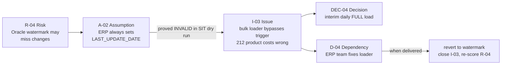

# 17 · RAID log (Risks · Assumptions · Issues · Dependencies · Decisions)

| Doc ID | NFMFG-DOC-17 | Owner | Programme manager | Contributors | Everyone on the project can raise an item | Snapshot | **2026-09-30** (Sprint 9 of build) |
|---|---|---|---|---|---|---|---|

The full log as a spreadsheet: [raid/RAID_LOG.csv](raid/RAID_LOG.csv) (32 items; opens in Excel, filter on `type`).
Risks are scored in detail in [16_RISK_MATRIX.md](16_RISK_MATRIX.md) / [raid/RISK_REGISTER.csv](raid/RISK_REGISTER.csv).
In Jira each row is an issue in project `NFMFG`, with issue types *Risk, Assumption, Issue, Dependency, Decision*.

## 1. What each letter means (with an example from this project)
| Letter | Question it answers | Example here | Typical end state |
|---|---|---|---|
| **R**isk | What *might* go wrong? | R-13: pen-test slot may not come in time for go-live | Closed (didn't happen), or becomes an Issue |
| **A**ssumption | What are we taking as true **without proof yet**? | A-02: ERP always sets `LAST_UPDATE_DATE` | **Validated** or **Invalid**. An invalid assumption usually creates an Issue. |
| **I**ssue | What *is* going wrong now? | I-03: ERP bulk loader bypasses the trigger, so cost changes are missed | Resolved, or closed with a workaround |
| **D**ependency | What do we need from **someone outside the team**, and by when? | D-02: platform team must provide NAT IPs for Snowflake | Delivered / late / escalated |
| **D**ecision *(RAIDD)* | What did we decide, who approved it, and why? | DEC-04: interim full load for ERP.PRODUCTS | Approved; links to ADRs (doc 14) |

Some organisations use "D = Decisions" and track dependencies elsewhere. Many data projects track both, which is why this log uses **RAIDD**.

## 2. Columns (what makes a RAID log usable, not decorative)
| Column | Rule |
|---|---|
| `id` | Prefix by type (R-, A-, I-, D-, DEC-). Never re-used. |
| `title` / `description` | Specific: *what, where, impact*. "Network issue" is not acceptable. |
| `owner` | **One named person** who drives it, even if another team does the work |
| `priority` | High / Medium / Low (for risks: from the matrix rating) |
| `status` | Open · In progress · Monitoring · Scheduled · Delivered · Validated · Invalid · Closed (– workaround) · Open – escalated · Open – late |
| `due_date` | When the next action is due, not "someday" |
| `next_action_or_resolution` | The **next concrete step**, dated. On closure, what happened and what the impact was. |
| `linked_items` | Risk ↔ Issue ↔ Dependency ↔ Decision links (this is where the story lives) |
| `jira_key`, `last_updated` | Traceability; anything not updated in 14 days is flagged in the weekly review |

## 3. The log (snapshot 2026-09-30)

### Risks (top open ones only; all 20 are in the risk register)
| ID | Title | Owner | Priority | Status | Due | Next action |
|---|---|---|---|---|---|---|
| R-13 | Pen test / InfoSec sign-off late | Data architect | 🟧 High | **Open – escalated** | 2026-10-10 | Escalated to the CISO office; on the 2026-10-02 steering committee agenda |
| R-16 | UAT testers unavailable in November | Programme manager | 🟨 Medium | Open | 2026-10-15 | Business to name 6 testers (A-04) |
| R-17 | Users distrust KPIs vs the legacy Excel | Business analyst | 🟨 Medium | Open | 2026-12-18 | Parallel-run plan drafted |
| R-04 | Oracle watermark misses deletes / untriggered updates | Data architect | 🟨 Medium | Open | 2026-10-31 | Weekly key-compare job in Sprint 10 |

### Assumptions
| ID | Assumption | Owner (validates it) | Status | Outcome |
|---|---|---|---|---|
| A-01 | MES timestamps are UTC | MES DBA | ✅ Validated | Confirmed 2026-06-18 |
| A-02 | ERP sets `LAST_UPDATE_DATE` on every change | ERP team lead | ❌ **Invalid** | The nightly bulk price loader disables triggers, which created **I-03** |
| A-03 | IoT volume ~600 events/s average | OT integrator | ✅ Validated | Load test: 540/s average, 2,600/s peak |
| A-04 | Business provides 6 UAT testers for 3 weeks | VP Operations | ⏳ Open | Due 2026-10-15 (drives R-16) |
| A-05 | Snowflake contract covers ~300 extra credits/month | FinOps | ✅ Validated | 2026-07-15 |
| A-06 | F64 Power BI capacity available | Power BI admin | ✅ Validated | 2026-07-10 |
| A-07 | Supplier file layout stays v1 until go-live | Procurement | ⏳ Open | Change notice required (ICD §4) |
| A-08 | Finance accepts production day = shift start | Finance controller | ✅ Validated | Became DEC-03 |

### Issues
| ID | Issue | Owner | Priority | Status | Due | Resolution / next action |
|---|---|---|---|---|---|---|
| I-01 | Firewall blocks SHIR → MES-SQL01:1433 | Platform lead | High | ✔ Closed | 2026-07-17 | Rule applied 2026-07-20. **Impact: 2 weeks**, absorbed by building silver on synthetic data |
| I-02 | 0.5% of MES runs have scrap > produced | MES product owner | Medium | In progress | 2026-11-15 | MES release 4.2 adds UI validation. Workaround: quarantine + weekly steward review. |
| I-03 | **ERP bulk loader bypasses `LAST_UPDATE_DATE`**: unit cost wrong for 212 products (found in a SIT dry run via reconciliation) | ERP team lead | **High** | In progress | 2026-10-31 | Loader fix ERP-889 (D-04). **Interim: daily full load** (DEC-04). |
| I-04 | CMMS API fails for page_size > 200 | CMMS vendor | Low | ✔ Closed – workaround | 2026-08-20 | page_size = 200 in the control table |
| I-05 | Snowflake publish blocked in TEST (network policy) | Platform lead | High | Open | 2026-10-10 | Waiting on D-02; publish verified in DEV |
| I-06 | P03 sensor gateway clock drift (≤ 40 min late) | OT integrator | Medium | In progress | 2026-10-20 | NTP fix; late events kept in bronze, P03 to be backfilled |
| I-07 | Key ADF engineer on unplanned leave | Tech lead | Medium | ✔ Closed | 2026-09-14 | Pairing rota covered it (R-07 mitigation worked) |
| I-08 | Plant-manager entitlement list not provided | VP Operations office | Medium | Open | 2026-10-20 | Needed for RLS; template sent |

### Dependencies
| ID | We need… | From | Status | Needed by | Blocks |
|---|---|---|---|---|---|
| D-01 | Firewall + private endpoints | Network team | ✔ Delivered (3 days late) | 2026-07-17 | Ingestion build |
| D-02 | Databricks NAT IPs in the Snowflake network policy | Platform team | 🔴 **Open – late** | 2026-10-10 | I-05, SIT of publish + Power BI |
| D-03 | CDC enabled on MES PROD (CHG-5521) | MES DBA | 📅 Scheduled 2026-10-19 | 2026-10-19 | Prod ingestion |
| D-04 | ERP loader fix (ERP-889) | ERP team | In progress | 2026-10-31 | Revert DEC-04 |
| D-05 | Pen-test slot (SEC-77) | InfoSec | 🔴 **Requested – unconfirmed** | 2026-10-10 | Go-live (R-13) |
| D-06 | PROD OAuth client for the CMMS API | CMMS vendor | ✔ Delivered | 2026-09-01 | Prod ingestion |
| D-07 | Service principal allowed to call Power BI APIs | Power BI admin | Open | 2026-10-24 | Event-driven refresh |
| D-08 | All suppliers on the SFTP drop | Procurement | In progress (2 of 3) | 2026-11-01 | File ingestion in prod |

### Decisions
| ID | Decision | Approved by | Date | Links |
|---|---|---|---|---|
| DEC-01 | ADF extracts; Databricks transforms | ARB | 2026-07-10 | ADR-01 |
| DEC-02 | Oracle by watermark, no GoldenGate in phase 1 (residual R-04 accepted) | Sponsor | 2026-07-10 | R-04, I-03 |
| DEC-03 | KPI glossary v1.0 baselined (production day = shift start) | VP Operations | 2026-07-17 | R-05, A-08 |
| DEC-04 | Interim daily full load of ERP.PRODUCTS until ERP-889 ships | Data architect | 2026-09-10 | I-03, D-04 |

## 4. One chain, end to end (how RAID items connect)

This is the story a reviewer (or interviewer) wants: a risk was identified, the assumption behind it was tested, it failed in **SIT** (caught by reconciliation, not by users), a decision contained the damage, and a dependency tracks the permanent fix.

## 5. How the RAID log is run
| Cadence | What happens | Who |
|---|---|---|
| Any time | Anyone raises an item in Jira (the type decides the template) | Whole team |
| **Weekly RAID review** (Tuesday, 30 min) | Walk every Open / High item: status, next action, date. Items not updated for 14 days are flagged. New risks are scored. | PM (chair), architect, tech lead, BA |
| Weekly status report | **Top 5** items with RAG, plus any new High/Critical (see §6) | PM |
| Steering committee (fortnightly) | Critical risks, late dependencies, decisions needing sponsor approval | Sponsor, business owner, PM, architect |
| Phase gates | All assumptions for the phase **validated or converted**; no Critical risk without an approved plan | Gate approvers |
| Closure | Every closed item has a resolution note and an impact (days, cost, data) | Owner |

**Escalation rules:**
- A risk scoring 🟥 Critical goes to the steering committee within 48 h.
- A dependency more than 5 working days late is escalated to the other team's manager.
- An issue blocking a milestone goes on the next steering committee agenda.

## 6. What it looks like in the weekly status report (week ending 2026-10-02)
> **Overall: 🟨 AMBER.** Build on track (Sprint 9 of 10); go-live date at risk from security sign-off.
>
> | # | Item | RAG | Ask |
> |---|---|---|---|
> | 1 | **R-13 / D-05** pen-test slot unconfirmed | 🔴 | **Sponsor to escalate with the CISO**; decision needed by 2026-10-10 on a waiver fallback |
> | 2 | **D-02** NAT IPs for Snowflake (late) blocks SIT of publish (I-05) | 🔴 | Platform manager commitment to 2026-10-10 |
> | 3 | **I-03** ERP loader bypasses the watermark, covered by the interim full load | 🟨 | ERP-889 on track for 2026-10-31 |
> | 4 | **A-04** UAT tester names due 2026-10-15 | 🟨 | VP Operations to nominate |
> | 5 | **I-08** plant entitlement list for RLS | 🟨 | Business to return the template by 2026-10-20 |

## 7. Setting it up in Jira / Confluence
- **Jira:** issue types Risk / Assumption / Issue / Dependency / Decision, with custom fields for Likelihood, Impact, Score (automation computes L×I), Response, Trigger, Due, and "Blocks milestone".
- A **Jira dashboard** filters open High/Critical items, overdue dependencies, and items not updated in 14 days.
- **Confluence:** this page embeds the Jira filters with the Jira Issues macro, so the page is always live. The CSV is only for export and for offline steering packs.

## 8. Interview talking points
- "We ran a RAIDD log in Jira and reviewed it weekly. The top five went into the status report, and anything critical went to the steering committee within 48 hours."
- "My favourite example: our **assumption** that the ERP always updated `LAST_UPDATE_DATE` turned out to be **invalid**. A nightly bulk loader disabled the triggers. Reconciliation against ERP totals in a **SIT dry run** caught it: 212 product costs were wrong. We logged it as an issue, took an interim decision to full-load that table, and tracked the ERP team's fix as a dependency. No user ever saw a wrong scrap cost."
- "Most of our delays were **dependencies**, not engineering: firewall rules, NAT IPs, pen-test slots. That's why we raise infrastructure requests in week 1 and track them with dates and owners outside our team."
