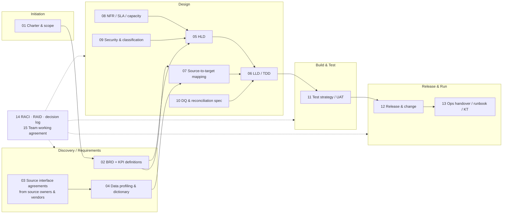

# Project delivery documentation pack: NorthForge Manufacturing Modernization

This folder holds the documents that make a multi-team, multi-vendor data project deliverable and
auditable. For each document it records who writes it, who hands it over to us, who validates it, who signs off,
where it is published, and how engineers use it day to day.

> **Git is the working copy, Confluence is the published copy.** Documents are drafted and
> reviewed here via PR (versioned, diffable), then published to the Confluence space `NFMFG`
> once approved. Jira epics and stories link to the Confluence page, not to a file on someone's laptop.
> See [00_DOCUMENT_GOVERNANCE.md](00_DOCUMENT_GOVERNANCE.md).

## 1. Document lifecycle across the project phases

## 2. Document catalogue

**Legend.** Us = the data engineering team (the senior data engineer or data architect writes it). Source owner = the business or IT owner of a source system. Vendor = a third party: MES vendor, CMMS SaaS, suppliers, the OT/IoT integrator, or Snowflake/Power BI partners.

| # | Document | Purpose (one line) | Authored / handed over by | Validated by | Signed off by | Phase gate |
|---|---|---|---|---|---|---|
| 01 | [Project charter & scope](01_PROJECT_CHARTER_AND_SCOPE.md) | What is in and out of scope, milestones, budget | Programme manager + architect | Steering committee | Business sponsor | Kick-off |
| 02 | [Business requirements (BRD) + KPI definitions](02_BUSINESS_REQUIREMENTS_BRD.md) | What the business needs; exact KPI formulas | Business analyst, with plant ops, quality and finance | Architect, BI lead | Business owner (VP Operations) | End of discovery |
| 03 | [Source system interface agreements (ICD / data contracts)](03_SOURCE_INTERFACE_AGREEMENTS.md) | How each source delivers data: tables, CDC, API spec, file layout, SLAs, contacts | **Handed over by source owners and vendors** (MES DBA, ERP team, CMMS vendor, suppliers, OT integrator) | Data engineer (profiling), architect | Source owner + architect (both sign) | Before design |
| 04 | [Data profiling report & data dictionary](04_DATA_PROFILING_AND_DICTIONARY.md) | What the data *really* looks like: nulls, keys, volumes, anomalies | Data engineers | Business analyst, source owner | Architect | Before STTM baseline |
| 05 | [High-level design (HLD)](05_HIGH_LEVEL_DESIGN.md) | Architecture, components, key decisions | Data architect | Enterprise architecture, security, platform team | Architecture review board (ARB) | Design gate 1 |
| 06 | [Low-level design / technical design (LLD/TDD)](06_LOW_LEVEL_DESIGN.md) | Pipelines, tables, jobs, frameworks, error handling, down to the object level | Senior data engineers | Peer engineers, architect | Architect / tech lead | Design gate 2 (per epic) |
| 07 | [Source-to-target mapping (STTM)](07_SOURCE_TO_TARGET_MAPPING.md) + [sttm/](sttm/) | Column-level lineage and transformation rules: the build contract | Data engineer + BA | Source owner (source side), BI lead (target side) | Architect + business data owner | Definition of Ready for build stories |
| 08 | [NFR, SLA & capacity](08_NFR_SLA_AND_CAPACITY.md) | Volumes, latency, SLA, retention, DR, cost | Architect | Platform / infra team | Business owner + IT service owner | Design gate 1 |
| 09 | [Security, access & data classification](09_SECURITY_AND_CLASSIFICATION.md) | Identities, secrets, network, roles, classification, RLS | Architect + security engineer | InfoSec / CISO office | InfoSec | Before any prod connectivity |
| 10 | [Data quality & reconciliation specification](10_DATA_QUALITY_AND_RECON_SPEC.md) | DQ rules and recon checkpoints, with owners and thresholds | Data engineer + BA | Data stewards (quality, finance) | Business data owner | With STTM |
| 11 | [Test strategy, test cases & UAT](11_TEST_STRATEGY_AND_UAT.md) | Unit, integration, reconciliation, performance and UAT approach, plus exit criteria | QA lead + data engineers | Architect | Business owner (UAT sign-off) | Before release |
| 12 | [Release, deployment & change management](12_RELEASE_AND_CHANGE.md) | CI/CD, environments, release checklist, CAB, rollback | DevOps / platform engineer | Tech lead | Change Advisory Board (CAB) | Each release |
| 13 | [Operations handover, runbook & KT](13_OPERATIONS_HANDOVER.md) | Support model, runbooks, alerts, SLAs, knowledge transfer | Data engineering team | L2/L3 support team | Service owner | Go-live / hypercare exit |
| 14 | [RACI, RAID log & decision log (ADR)](14_RACI_RAID_DECISIONS.md) | Who does what; risks, assumptions, issues and dependencies; why decisions were made | Programme manager + architect | Steering committee | Sponsor | Continuous |
| 15 | [Team working agreement (Jira, DoR/DoD, doc usage)](15_TEAM_WORKING_AGREEMENT.md) | How every engineer uses these documents to build correctly | Tech lead | Team | Tech lead | Sprint 0 |

The technical reference documents for the **built** solution already sit one level up in `docs/`:
ARCHITECTURE, ADF_FRAMEWORK, CDC_EXPLAINED, DATA_MODEL, SECURITY, etc. The delivery documents link to
them instead of duplicating them. Once approved, they become child pages of the HLD/LLD in Confluence.

## 3. Handover: what arrives from outside the team

| From | Hands over | Format we require | We return |
|---|---|---|---|
| MES vendor / plant IT DBA | Table DDL, CDC enablement confirmation, retention, change windows, sample extracts | Completed section of doc 03 + DDL scripts | Profiling results (04); agreed ICD signed |
| ERP (Oracle) team | Table list, `LAST_UPDATE_DATE` behaviour, delete semantics, read-only account | Doc 03 section + data dictionary | Questions log; signed ICD |
| CMMS SaaS vendor | OpenAPI/Swagger spec, auth (OAuth2 client), rate limits, pagination, sandbox tenant | OpenAPI JSON/YAML + doc 03 section | Contract test results |
| Suppliers (via procurement) | File layout spec, naming, delivery schedule, sample files, SFTP details | Supplier file specification (doc 03 §5) | Validation report of sample files |
| OT / IoT integrator | Telemetry JSON schema, device ID scheme, Event Hub throughput, ordering and duplicate guarantees | JSON Schema + doc 03 §6 | Stream test report |
| Business (plant ops, quality, finance) | KPI definitions, report mock-ups, user groups and plant entitlements | Doc 02 + KPI glossary sign-off | Prototype report for feedback |
| InfoSec | Security requirements, classification policy, pen-test requirements | Policy references | Doc 09 for approval |
| Platform / cloud team | Landing zone, subscriptions, networking, private endpoints | Infra design references | NFR (08) |
